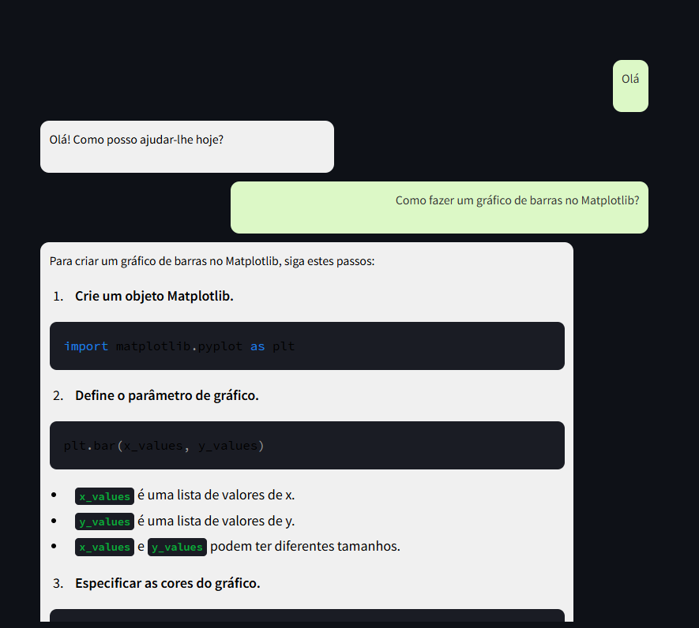

# ChatBot Ollama

O objetivo deste projeto é mostrar a facilidade de criação de chatbots com o Ollama usando uma abordagem simples.

## Instalação

Para utilizar este ChatBot, você precisará instalar o Ollama em sua máquina local. As instruções completas estão disponíveis no site [ollama.com](https://ollama.com/).

### Passos para Instalação

1. **Instalar o modelo a ser usado:**
   No seu terminal, execute:
   ```bash
   ollama pull gemma:2b
   ```

2. **Instalar os pacotes Streamlit e Ollama:**
   Ainda no terminal, execute:
   ```bash
   pip install streamlit ollama
   ```

3. **Clonar o repositório:**
   ```bash
   git clone https://github.com/danttis/ChatBot-Ollama.git
   ```

4. **Entrar na pasta do projeto e executar a aplicação:**
   ```bash
   cd ChatBot-Ollama
   python -m streamlit run dash.py
   ```

### Interface do Usuário

Após seguir os passos acima, você verá uma interface similar a esta:


## Sobre o ChatBot

Este ChatBot possui uma interface simples e responde apenas às mensagens enviadas. Ele não possui memória de longo prazo; as mensagens são armazenadas apenas na tela e na sessão do navegador.
